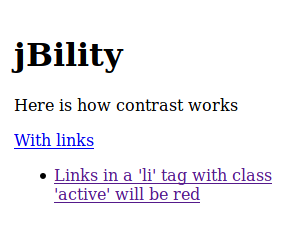
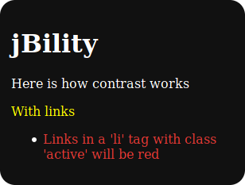

# jBility


### **Author**: Uriel Cairê Balan Calvi
jBility is a free set of accessibility functions that uses JQuery.  
The goal is to allow people with low vision to see your website's content.

## What does jBility?
Currently jBility has three functions:

### Contrast 
Changes the css of your page, highlighting texts and links. This function uses cookies to work. By default, the cookie die when browser is closed.  
<p align="center">




</p>

### Increase Font 
Increases all fonts of your page.

### Decrease Font
Decreases all fonts of your page.

These functions make it easier to view a page's content.

## Example
A simple example can be found in `dist/example` folder, or online [here](http://github.io/Pliavi/jbility/dist/example/index.html)

## Installation
Download the [latest JQuery] version to your project.

Clone jBility project and copy the `dist` folder to the root of your project using:
```sh
git clone https://github.com/urielcaire/jbility.git
```
Or using the download button.

Reference the css file properly in your HTML `<head>` tag.
```html
<link rel="stylesheet" type="text/css" href="path/to/jbility/css/jbility.min.css">
```

Insert the code below on your footer or before close body:
``` html
<div class="acess-container">
	<div id="jbbutton" class="balloon" title="Accessibility"><span class="balloontext">Accessibility</span></div>
	<div id="acess-icons">
		<div class="acess-icon balloon"><span class="balloontext">Contrast</span></div>
		<div class="acess-icon balloon"><span class="balloontext">Increase Font</span></div>
		<div class="acess-icon balloon"><span class="balloontext">Decrease Font</span></div>
	</div>
</div>
```

Reference the js files (jQuery and jBility) properly at the bottom of your `<body>` tag.
```html
<script type="text/javascript" src="path/to/jquery-3.1.1.min.js"></script>
<script type="text/javascript" src="path/to/jbility/js/jbility.min.js"></script>
<!-- </body> ->
```

# Build
To build your own jBility, you need to clone the repository by running:
```sh
git clone https://github.com/urielcaire/jbility.git
```

After that you will need to install the `gulp-cli`:
```bash
npm install --global gulp-cli
# or with yarn
yarn add global gulp-cli
```

Now you are able to build a full version of jBility, so enter the jBility folder and run the build script:
```bash
cd jbility && npm build
# or with yarn
cd jbility && yarn build
```

To watch files while change your custom version you can use the `watch` command:
```bash
npm watch
# or with yarn
yarn watch
```

## Enjoy it!
---
### Special thanks to [JQueryScript](http://www.jqueryscript.net/ "JQueryScript") for voluntarily posting my plugin and host my demo page for free.

[latest JQuery]: http://jquery.com/
